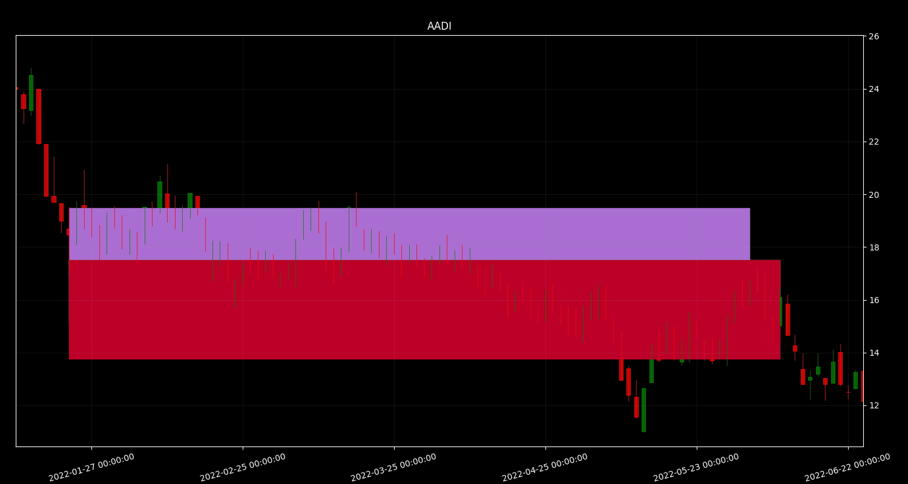
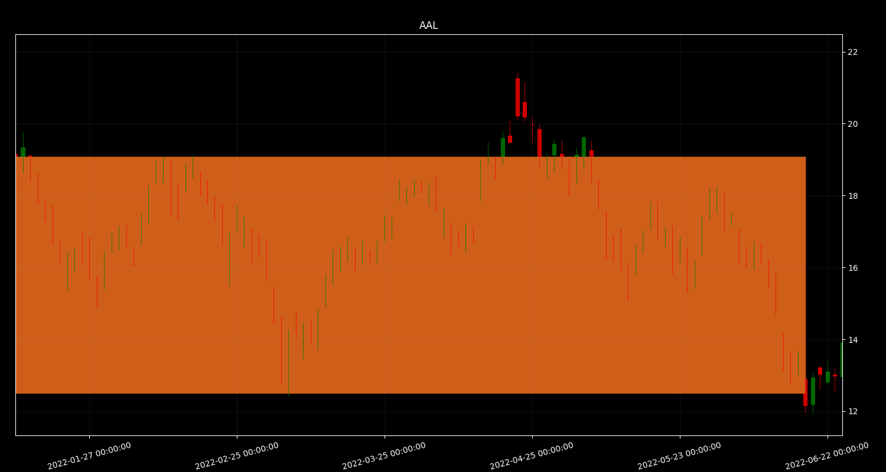

### Instructions:
```
git clone https://gitlab.com/beefjerkytime/sr_box_filter
cd sr_box_filter
pip install -r requirements.txt
```
#### Run analysis:
```
python src/sr_cli.py --sector ALL --show-candles --colors
```

#### Run notebook:
```
# from sr_box_filter directory
PYTHONPATH=$(pwd)/src jupyter notebook
```



